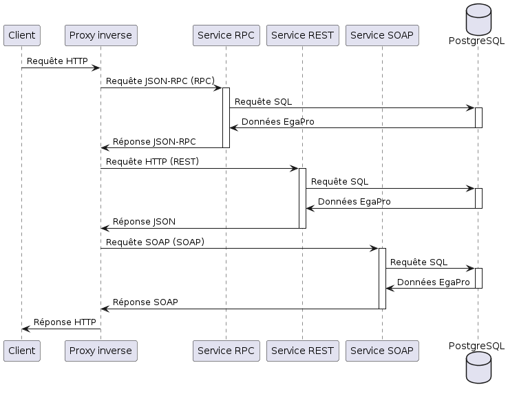

# STM_Architecture_Exercice-15
Diagramme de Séquence
Le diagramme de séquence inclus dans ce repo illustre les interactions entre les différents composants de l'architecture de services lorsqu'une requête est reçue, traitée et une réponse est renvoyée. Il offre une vue détaillée du flux d'exécution des opérations.

Aperçu du Projet
Ce projet consiste à concevoir et développer une architecture de services qui distribue les données de l'Index EgaPro. Le projet est réalisé en groupe de maximum 3 étudiants et implique la création de différents services, la documentation de l'architecture, ainsi que l'intégration de plusieurs schémas pour une meilleure compréhension et une utilisation facilitée.

Documentation de l'API REST avec Swagger
L'API REST développée dans le cadre de ce projet est entièrement documentée à l'aide de Swagger. Cette documentation fournit une description détaillée de chaque endpoint, des paramètres acceptés, des réponses attendues et des exemples d'utilisation.

Documentation de l'API SOAP avec WSDL
L'API SOAP développée dans ce projet est également documentée avec un fichier WSDL (Web Services Description Language). Le fichier WSDL décrit les services disponibles, les opérations qu'ils fournissent, les types de données utilisés et les protocoles de communication.

Documentation de l'utilisation du service gRPC de RPC et les requirements:

Installer gRPC: python -m pip install grpcio

Comment fonctionne gRPC ?

 une application cliente peut appeler directement une méthode sur une application serveur située sur une machine différente, comme s'il s'agissait d'un objet local, ce qui facilite la création d'applications et de services distribués. Comme dans de nombreux systèmes RPC, gRPC s'appuie sur l'idée de définir un service, en spécifiant les méthodes qui peuvent être appelées à distance avec leurs paramètres et leurs types de retour. Côté serveur, le serveur implémente cette interface et exécute un serveur gRPC pour gérer les appels des clients. Côté client, le client dispose d'un stub (appelé simplement client dans certains langages) qui fournit les mêmes méthodes que le serveur.

 Les clients et serveurs gRPC peuvent fonctionner et communiquer entre eux dans divers environnements - des serveurs internes à Google à votre propre bureau - et peuvent être écrits dans n'importe quel langage supporté par gRPC. Ainsi, par exemple, vous pouvez facilement créer un serveur gRPC en Java avec des clients en Go, Python ou Ruby. De plus, les API Google les plus récentes proposent des versions gRPC de leurs interfaces, vous permettant d'intégrer facilement les fonctionnalités de Google dans vos applications.

Sources

Utilisation de PRotocol Buffer:

Protocol Buffers (Protobuf) est un langage de description d'interface utilisé pour définir des structures de données sérialisées. Il est indépendant du langage de programmation et de la plateforme, ce qui signifie qu'il peut être utilisé pour générer du code pour différents langages de programmation et être utilisé sur différentes plateformes. C'est un language textuel basé sur .proto. Il permet de définir des messages, des services, des types de données et d'autres éléments qui composent une structure de données sérialisée.

    installation requises pour Protocol Buffer:
        - python -m pip install grpcio-tools
        - installer l'extension Protobuf
        - genérer un fichier python du Fichier .proto avec: protoc --python_out=. your_file.proto

Base de Données Commune
Tous les services développés dans ce projet partagent une base de données commune. Cette base de données est conçue pour stocker les données de l'Index EgaPro et permettre aux différents services d'accéder et de manipuler ces données de manière cohérente.

Services Développés
Service de Distribution des Données EgaPro en RPC :
Ce service utilise le protocole RPC (Remote Procedure Call) pour distribuer les données de l'Index EgaPro.

Service de Distribution des Données EgaPro par API REST :
Ce service expose une API RESTful permettant d'accéder et de manipuler les données de l'Index EgaPro via des endpoints HTTP.

Service de Distribution des Données EgaPro par API SOAP :
Ce service fournit une API SOAP pour accéder aux données de l'Index EgaPro en utilisant le protocole SOAP (Simple Object Access Protocol
